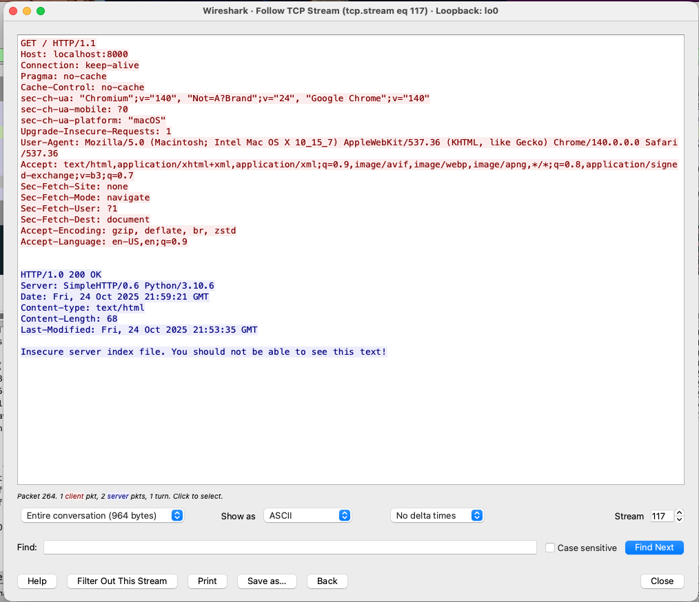
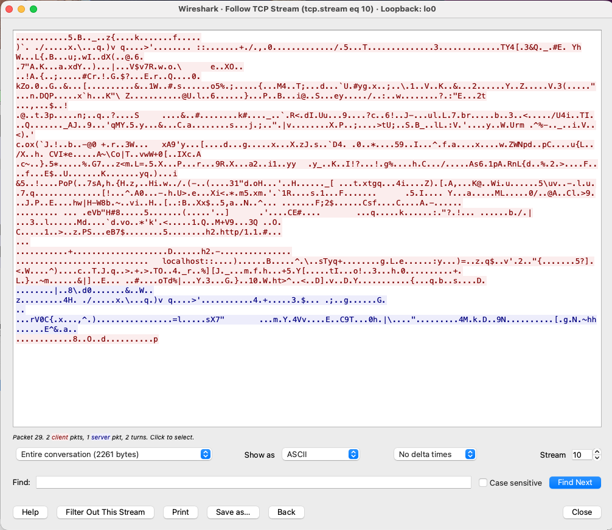
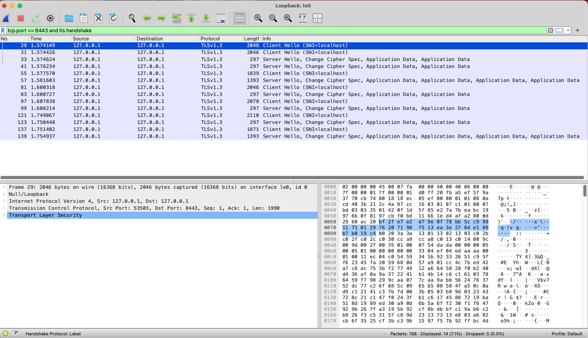

# Public Key Infrastructure Writeup

## Task 1: Host a local web server
For this task, I created a basic index.html to be served by the Python
native HTTP server. When I connected to this server using a web browser,
I was able to see the contents of the index.html file, which confirmed that
the server was running correctly. I also saw a warning in Chrome that the
connection was not secure, indicating that the server was using HTTP.

## Task 2: Identify why HTTP is not secure
For this task, I downloaded Wireshark to capture my inbound and outbound
network traffic. I started a capture on my network interface (lo0) and then
accessed my local web server using a web browser. In Wireshark, I filtered
the traffic to show only HTTP packets on port 8000 (as I had set for the server).
I observed that the HTTP requests and responses were sent in plain text, through TCP, which you can see in the screenshot below.



As shown in the screenshot, the HTTP GET request for the index.html file
is visible in plain text, along with the server's response containing the
HTML content. This means that anyone who intercepts this traffic (man in the
middle) can easily read the data being transmitted, including any sensitive
information like passwords.

To view the entire packet trace of the HTTP traffic, please open
`http_unsecure.pcapng` in Wireshark and apply the filter
`http && tcp.port == 8000`. There you will see all the packets exchanged between
the client and my server during the HTTP session.

## Task 3: Create a self-signed certificate and upgrade your web server to HTTPS

### (a) Why can't you obtain an SSL certificate for your local web server from a certificate authority?
Certificate Authorities can only issue SSL certificates for publicly accessible domains. Since my local web server is running on localhost (127.0.0.1), it does not have a publicly accessible domain name, and therefore, a certificate authority cannot verify its ownership or identity. Therefore, I had to create a self-signed certificate for my local server.

### (b) Generating a self-signed certificate and upgrading to HTTPS
To generate a self-signed certificate, I used the following OpenSSL command:
```bash
openssl req -x509 -newkey rsa:2048 -nodes \
  -keyout server.key -out server.crt \
  -days 1 -subj "/CN=localhost"
```
This command created two files: `server.key` (the private key) and `server.crt` (the self-signed certificate). I then created a file called `https_server.py`
to use the certificate we generated and serve HTTPS traffic.

Note that this key and certificate are only valid for one day (`-days 1`) for
testing purposes, so if whoever is grading this runs the server after that period, you will need to generate a NEW certificate.

### (c) Capturing HTTPS traffic with Wireshark
After starting the HTTPS server, I accessed it using a web browser. In Wireshark,
I filtered via `tcp.port == 8443 and tls.handshake` to capture the TLS handshake packets. All of the HTTPS traffic is encrypted, as shown in the screenshot below.



And in the overall packet trace, you can see that the HTTP GET request and
response are no longer visible in plain text, it is all meaningless characters
to the naked eye.



To view the entire packet trace of the HTTPS traffic, please open
`https_secure.pcapng` in Wireshark and apply the filter
`tcp.port == 8443 and tls.handshake`. There you will see all the packets
exchanged between the client and my server during the HTTPS session.

## Conclusion
DON'T USE HTTP! Always use HTTPS to ensure your data is encrypted and secure
from men-in-the-middle attacks and other forms of eavesdropping.